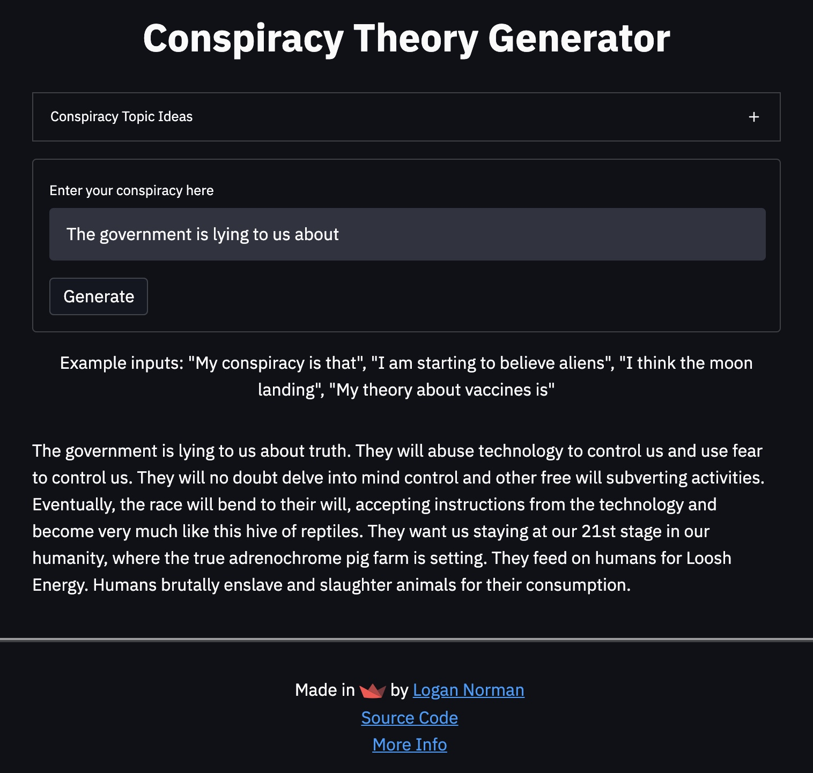

# Conspiracy Theory Generator


Project objective: Generate conspiracy theories with natural language processing.

Have fun with the application, it's hosted hosted here: 

https://share.streamlit.io/lognorman20/conspiracy_generation/main/app.py

## Overview

**Check out my in-depth description on Medium here:** 

[coming soon]

Recently, I've been reading  conspiracy theories about various topics from the Earth being flat to birds not existing. Some of the justifications behind these theories I found quite outlandish and thought that a conspiracy could be proved by any reason. This led me to try to generate reasonings behind conspiracy theories.

This repository walks you through everything I did to build the algorithm:

1. Built a dataset by using Reddit's API to scrape nearly 6,000 comments from /r/conspiracy
2. Finetuned GPT-2 on the dataset to receive a loss of less than 0.1
3. Optimized model parameters to generate more human-like theories
4. Built a Streamlit application for the model
5. Deployed the model on Streamlit and Google Cloud Platform

## Installation & Requirements

If you'd like to play with some code, clone this repo, create a blank Anaconda environment, and install the requirements file:
```bash
# Clones this repo 
git clone https://github.com/lognorman20/con_gen.git
# Move into this repos directory
cd conspiracy_generation
# Creates new environment called 'con_gen'
conda create -n con_gen python=3.7
# Activates the environment we just made
conda activate con_gen
# Install the requirements
pip install -r requirements.txt
```

## References
[aitextgen](https://github.com/minimaxir/aitextgen)

[Conspiracy Theory Reddit Forum](https://www.reddit.com/r/conspiracy/)

[How to generate text: using different decoding methods for language generation with Transformers](https://huggingface.co/blog/how-to-generate)

[Python Reddit API Wrapper](https://praw.readthedocs.io/en/latest/)

## Contact
Feel free to reach out to me on LinkedIn and follow my work on Github! 

<br>
<p align="center">
<a href="https://www.linkedin.com/in/logannorman/">

</a>

<a href="https://github.com/lognorman20">

</a>
</p>
